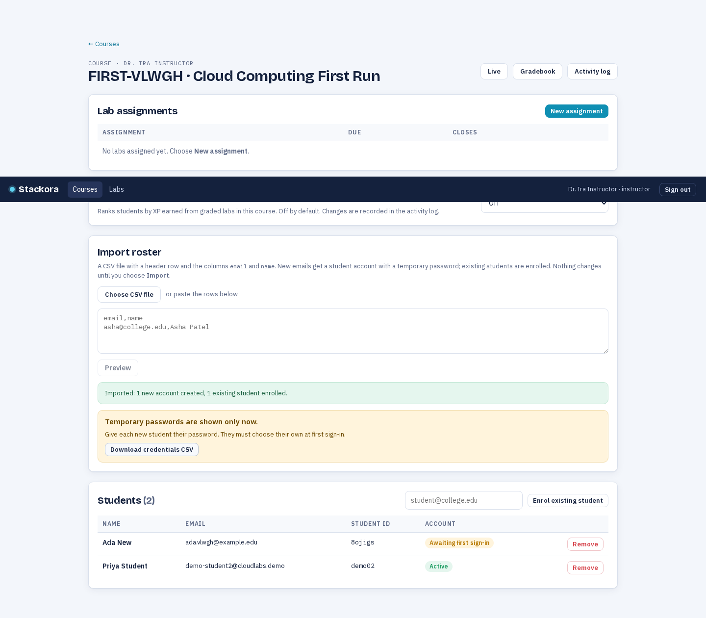
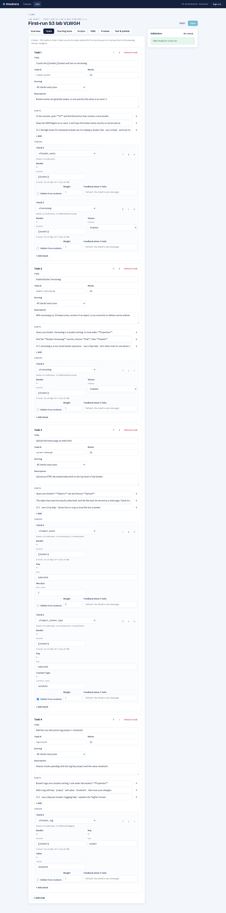
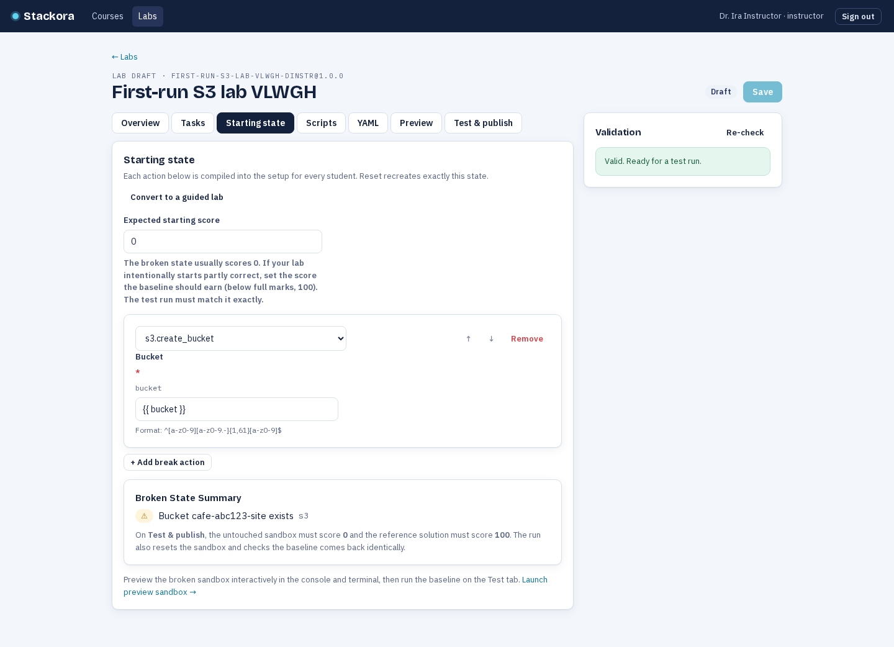
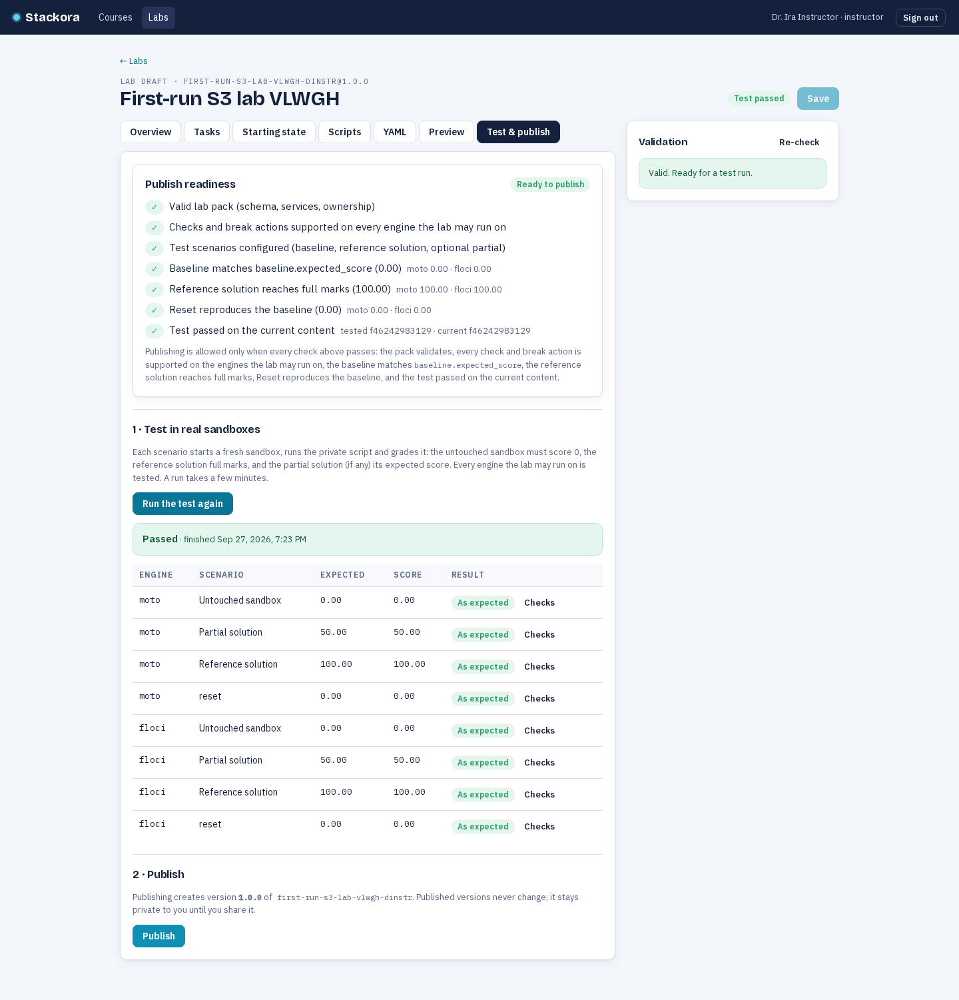
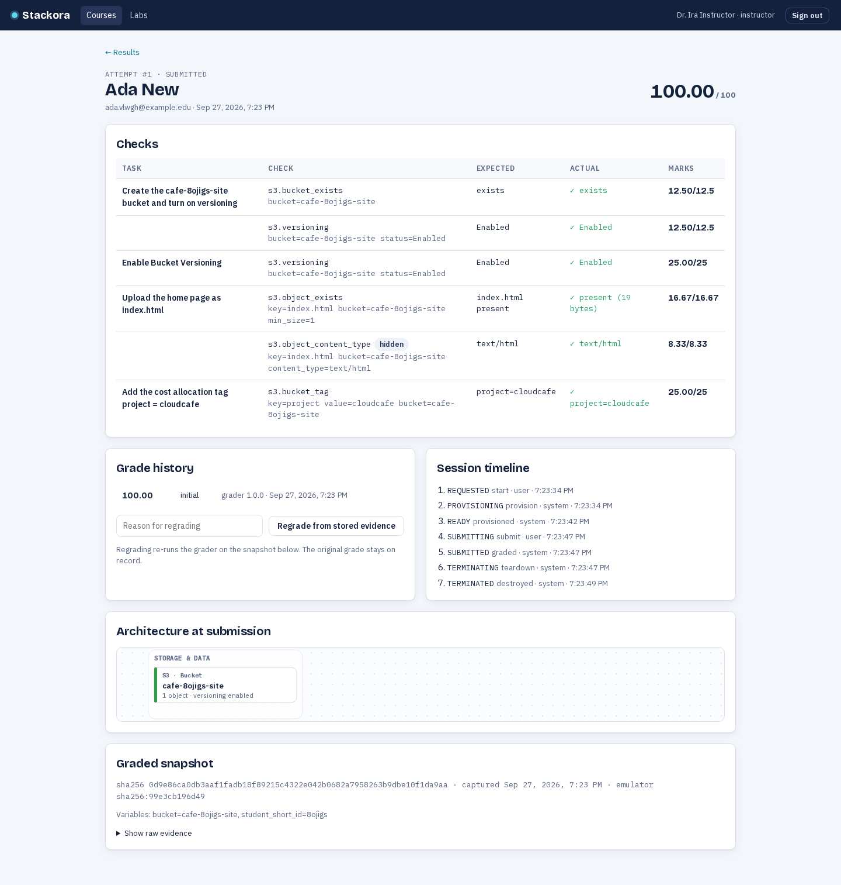

# Instructor quickstart — your first lab in Stackora

This guide takes a new instructor from an empty account to a graded student result. **You never write YAML,
shell or SQL, and you never touch a server**: everything below happens in the browser. The screenshots come
from the automated first-run journey (`apps/web/e2e/instructor-first-run.spec.ts`), so they are exactly what
the product does.

> **You need:** the Stackora stack running (`scripts/up.sh`, then `scripts/demo-reset.sh`) and an instructor
> account. On a laptop demo, sign in at `http://localhost:3000` as `demo-instructor@cloudlabs.demo`; the login
> page lists the demo accounts and signs you in with one click.

---

## 1. Create your course

Open **Courses** and choose **New course**. Give it a code (for example `CS-341`) and a title. You become the
course instructor automatically — no administrator is needed.

## 2. Import your roster

Open the course and paste your class list into **Roster** as CSV:

```csv
email,name
ada@example.edu,Ada New
grace@example.edu,Grace Hopper
```

Choose **Preview**: every row is checked (email syntax, duplicates, missing names) and nothing is saved yet.
When it says `0 with errors`, choose **Import**. New students get a one-time temporary password, shown **once**
and downloadable as a CSV — share it with the student; they must change it at first sign-in. Existing accounts
are simply enrolled.



## 3. Build your first lab from a template

Open **Labs** and choose **New lab**. Pick a template — S3 basics, DynamoDB basics, IAM least privilege, EC2
web server, Lambda serverless or IAM break-fix. A template is a **working lab**, not a blank page: tasks,
checks, the reference solution and expected scores are copied into your own draft at version 1.0.0.



On the **Tasks** tab you can:

- rename a task, change its marks or write hints in plain language;
- add a check with **+ Add check** — the form is generated from the grader's own parameter model, so it can
  never drift from what grading accepts (choose the check type, fill the fields, done);
- reorder or remove tasks and checks.

The **Validation** panel is always visible and every problem is placed on the row that caused it. Nothing is
visible to students until you publish.

## 4. Configure the starting state (break-fix, no shell)

Want students to **repair** something instead of building from scratch? On the **Starting state** tab choose
**Make this a break-fix lab**, then add one or more **typed break actions** (for example *S3 · create bucket*,
*IAM · attach managed policy*, *EC2 · authorize ingress*). You pick the action and fill its form; Stackora
compiles it into the setup that runs for every student, and **Reset** recreates the same broken state.

The **Broken State Summary** lists what the broken environment will contain. If your lab should start partly
correct, set **Expected starting score** — the test run will require exactly that score.



There is deliberately **no shell editor**: break actions are declarative data, so a typo can't run commands on
your students' machines.

## 5. Preview the broken sandbox

From the Starting state tab choose **Launch preview sandbox**. A real, isolated sandbox starts with your
declared state; inspect it in the **Console** or the **Terminal**, use **Reset** to recreate the broken state,
and **Stop** when you are done. A preview is not a student session: it never creates an attempt, grade, XP,
badge or leaderboard entry.

## 6. Test, then publish

Open **Test & publish**. The **Publish readiness** checklist is the gate, and it is exactly what publishing
requires:

- the pack is valid (schema, services, ownership);
- every check and break action is supported on every engine the lab may run on;
- the untouched sandbox scores `baseline.expected_score` (0 unless you said otherwise);
- the reference solution scores full marks;
- Reset reproduces the baseline;
- a test passed on the **current** content.

Choose **Run test**: each scenario runs in a fresh real sandbox, and the per-check results appear as they
land. When the checklist is green, choose **Publish**. Publishing creates an immutable version that stays
private to you until you share it.



## 7. Assign it

Open the course and choose **New assignment**, pick your lab and a title. Students see it in **My labs** as
soon as it opens.

## 8. Watch the results

When a student submits, the assignment page shows their score and every attempt. Click an attempt to drill
into the **evidence**: each task and check with what was expected and what the student's sandbox actually
contained. Use **Export CSV** for the gradebook, and the course **Live** view while a class is working.



---

## If something goes wrong

| Symptom | What to do |
|---|---|
| The validation panel shows problems | Each row jumps to the tab and field that caused it. Fix and save. |
| The test run fails | Open the scenario row: it names the failing tasks and the expected vs actual score. The reference solution must reach full marks. |
| "Test required" when publishing | The content changed after the last run. Run the test again — it is quick and cheap. |
| A template is greyed out | Its built-in pack is not installed on this deployment (`demo-reset` imports them). |
| A student cannot sign in | New accounts must change the temporary password from the roster import. Passwords are shown only once; reset a student's password from the course roster if lost. |

## What you never need

- **YAML** — the YAML tab exists as an escape hatch for experienced authors, but every step above is a form.
- **Shell** — scripts are only the private reference solution; break-fix setups are typed actions.
- **SQL or database access** — courses, rosters, labs and results are all product surfaces.
- **Developer tooling** — no CLI, no Docker commands, no server access. If you can use a browser, you can
  author and run a lab.
